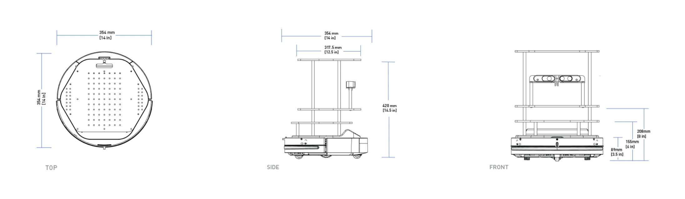

# [Turtlebot 2](https://www.turtlebot.com/turtlebot2/)

  

## [Experimentation video]

  

## Team members

## Table of Contents  
[Overview](#overview)  
[Specifications](#specifications)  
[Features ](#features) 
[Applications](#applications)

## ROS Noetic Installation
 - [ROS wiki](http://wiki.ros.org/noetic/Installation/Ubuntu)

## Experiments
  - [Teleoperation](./Teleoperation)
  - [Environement mapping](./Mapping%20a%20environment)
  - [Velocity scaling](./Velocity%20scaling)
  
## Overview
- TurtleBot 2 has been the world’s most popular low cost, open source robot for education and research
- This second generation personal robot is equipped with a powerful Kobuki robot base, a dual-core netbook, Orbbec Astra Pro Sensor and a gyroscope. 
- All components have been seamlessly integrated to deliver an out-of-the-box development platform.
- Despite being out of factory production, TurtleBot 2 is one of the popular choices of experimentation for developers, enthusiasts, hobbyists exploring robotics.

## Specifications

|  Size  |  Weight  |
|  ---------- |  -------------  |
|  Dimensions  |  354x354x420 mm  |
|  Weight  |  6.3 kg  |
|  Max Payload  |  5 kg  |

|  Speed  |  Performance  |
|  ---------  |  ----------  |
|  Max Speed  |  0.65 m/s  |
|  Obstacle Clearance  |  15 mm |
|  Drivers and APIs  |  ROS  |

  

## Features

> ### Low Cost
Turtlebot2 was built for the cost-conscious needs of education and early-stage development. It uses off-the-shelf consumer electronics like the Orbbec Astra Pro sensor, a standard netbook and a robot base built from a repurposed robot vacuum cleaner to keep costs low. Turtlebot2 is the most affordable advanced ROS robot on the market.
 
> ### Built for ROS
Turtlebot was designed in collaboration with the original makers of ROS, Willow Garage. Since then, ROS has quickly become the go-to software platform for roboticists around the world. Not only will the TurtleBot seamlessly integrate with your existing ROS-driven robots, it also offers an affordable platform to get started learning with ROS.
 
> ### Rolling Start
ROS comes pre-installed and configured on the netbook. Turtlebot comes fully assembled, integrated and tested. It is ready for basic operation right out of the box. Power it on and enter commands. If this is your first time using ROS, Turtlebot is the best place to start.

### Applications
The TurtleBots are mainly used in AAL (Ambient Assisted Living), as a domestic robot able to perform assistance tasks, in research of navigation, localization and mapping and as an educational tool. Less actively, the robot is also used in multi-robot systems, mobile manipulation and tele-operation.
